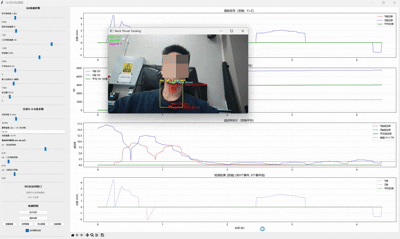
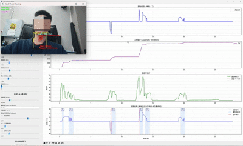

# 吞咽检测与智能喂食决策系统

基于计算机视觉与 IMU 传感器的颈部吞咽实时检测系统，结合机器学习方法实现安全吞咽容量（SSC）自适应估计，用于辅助吞咽障碍患者的喂食量决策[...]

---

## 功能概览

- **实时吞咽检测**：融合 OpenPose 颈部关键点、Orbbec RGB-D 相机深度信息与 YOLO 目标检测，通过 QV（二次变分）算法识别吞咽事件
- **IMU 头部运动采集**：支持接入 HiPNUC 系列 IMU 传感器，佩戴于头部获取头部运动姿态数据，用于对比测试算法对头部运动的抑制效果
- **实时可视化监测**：基于 Tkinter + Matplotlib 的 GUI 界面，实时显示追踪轨迹与吞咽检测结果
- **SSC 喂食量决策**：基于 HDBSCAN 聚类与核密度估计，学习个体吞咽模式，动态推荐安全喂食量

---

## 效果展示

### 使用算法



### 未使用算法



---

## 项目结构

```
.
├── neck_throat_v2/              # 核心检测模块
│   ├── main.py                  # 主程序入口
│   ├── camera.py                # Orbbec 相机驱动（支持模拟模式）
│   ├── openpose_utils.py        # OpenPose 关键点提取工具
│   ├── yolo_detector.py         # YOLOv5 吞咽检测
│   ├── qv_detector.py           # QV 吞咽事件检测核心算法
│   ├── qv_realtime_monitor.py   # 实时监测 GUI
│   ├── tracker_data.py          # 追踪数据结构管理
│   ├── IMU.py                   # IMU 串口驱动
│   ├── config.py                # 配置管理
│   └── start.bat                # Windows 一键启动脚本
│
├── machine_learning/            # SSC 喂食量决策模块
│   ├── train.py                 # SwallowAnalyzer 核心类（HDBSCAN + KDE）
│   ├── train_ui.py              # 训练界面
│   ├── predict_ui.py            # 预测界面
│   ├── main.py                  # 独立分析脚本
│   └── start_predict_ui.bat     # 启动预测界面
│
├── imu-py/
│   └── parsers/
│       ├── hipnuc_serial_parser.py   # HiPNUC 串口协议解析
│       └── hipnuc_nmea_parser.py     # HiPNUC NMEA 协议解析
│
├── sort.py                      # SORT 多目标追踪算法
├── tracker_config.json          # 默认追踪器配置
├── preset/
│   └── qv_monitor_config_export.json  # 预设参数配置
└── requirements.txt             # Python 依赖列表
```

---

## 环境要求

- Python 3.8+
- Windows 10/11（`start.bat` 脚本）
- 硬件（可选）：
  - Orbbec RGB-D 相机（无硬件可使用 `--simulate` 模式）
  - HiPNUC IMU 传感器
  - NVIDIA GPU（运行 OpenPose / YOLOv5 时推荐）

### 第三方依赖（需手动安装）

以下组件体积较大，不包含在仓库中，需自行下载：

| 组件 | 说明 | 放置路径 |
|---|---|---|
| [OpenPose](https://github.com/CMU-Perceptual-Computing-Lab/openpose) | 人体关键点检测 | `openpose_bin/`、`openpose_model/` |
| [YOLOv5](https://github.com/ultralytics/yolov5) | 目标检测框架 | `yolov5/` |
| Orbbec SDK | 深度相机驱动 | 参考官方安装文档 |

### Python 依赖安装

```bash
pip install -r requirements.txt
```

核心依赖包括：`opencv-python`、`numpy`、`torch`、`hdbscan`、`scikit-learn`、`matplotlib`、`filterpy`、`pyserial`、`Pillow`

---

## 快速启动

### 方式一：一键启动（Windows）

```bat
# 连接硬件相机后运行
cd neck_throat_v2
start.bat

# 无硬件，使用模拟模式
start.bat --simulate

# 禁用 OpenPose（仅使用 YOLO）
start.bat --no-openpose
```

### 方式二：命令行启动

```bash
# 在项目根目录执行
python -m neck_throat_v2.main

# 模拟模式
python -m neck_throat_v2.main --simulate
```

### SSC 喂食量预测界面

```bat
cd machine_learning
start_predict_ui.bat
```

---

## 核心算法说明

### QV 吞咽检测（`qv_detector.py`）

基于二次变分（Quadratic Variation）方法检测颈部位移信号中的吞咽事件：

1. 使用卡尔曼滤波器对颈部位移进行平滑与加速度估计
2. 计算局部波动率与二次变分序列
3. 双阈值判断（`H` 高波动率阈值 + `H2` 二阶导数阈值）检测吞咽峰值
4. 时间窗口抑制防止重复检测

### SSC 安全吞咽容量估计（`machine_learning/train.py`）

1. 以历史吞咽时间序列为特征，使用 **HDBSCAN** 进行无监督聚类
2. 对各聚类使用**核密度估计（KDE）**建立概率密度模型
3. 结合上次喂食量、动态时间窗函数与患者调整系数 `γ` 计算推荐喂食量

---

## 配置说明

主要参数通过 `tracker_config.json` 配置，支持运行时通过 GUI 调整并导出为预设文件（`preset/`）。

关键参数：

```json
{
  "openpose_interval": 3,
  "yolo_interval": 2,
  "yolo_conf_threshold": 0.25,
  "tracker_window_size": 600,
  "neck_buffer_size": 7,
  "neck_smoothing_alpha": 0.2
}
```

---

## 致谢

- [SORT](https://github.com/abewley/sort) - 多目标追踪算法
- [OpenPose](https://github.com/CMU-Perceptual-Computing-Lab/openpose) - 人体姿态估计
- [YOLOv5](https://github.com/ultralytics/yolov5) - 目标检测
- [HDBSCAN](https://github.com/scikit-learn-contrib/hdbscan) - 层次密度聚类
